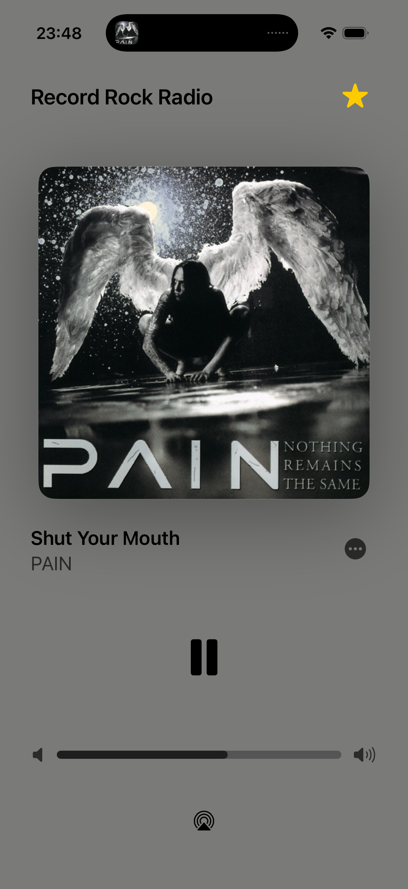
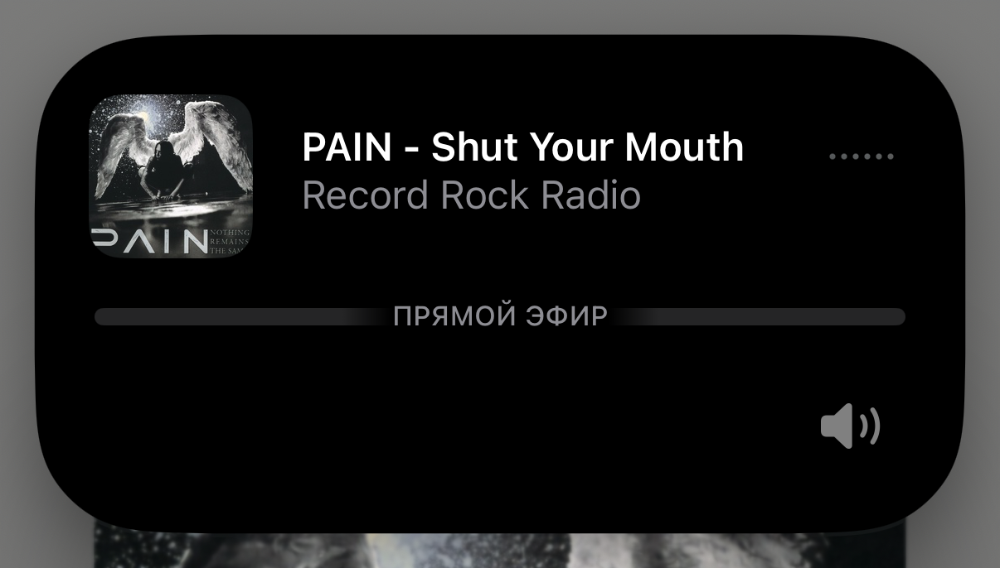

# RadioPlayer Example

This iOS 17 SwiftUI app demonstrates a complete player built with `RadioKit`.
It uses `RadioPlayer.shared` for playback, metadata, artwork colors, remote commands, and Now Playing information.

The player starts Record Rock Radio when the app opens.
Apple Music access adds catalog artwork and song links, but playback does not require that access.

## Demo Features

- Live stream metadata provides the current artist and song title.
- Apple Music search replaces the station image with matching song artwork.
- The artwork's dominant color updates the player background and readable foreground colors.
- A custom volume slider controls the system output volume and follows external volume changes.
- The volume track expands during a drag and supports VoiceOver adjustable actions.
- The player supports AirPlay, system media controls, stream errors, and reduced-motion settings.

## System Now Playing

RadioKit configures Now Playing when playback starts. The example does not need screen-specific integration code.

- The system identifies the station as a live stream.
- The current artist, song title, station name, and artwork update when stream metadata changes.
- Apple Music artwork replaces station artwork after a successful catalog match.
- Playing, paused, and stopped states stay synchronized with the system interface.
- Play, pause, and toggle commands work through `MPRemoteCommandCenter`.
- iOS presents the same state on the Lock Screen, in Dynamic Island, and in other system media controls.
- RadioKit removes commands and Now Playing information when the player releases the station.

The app target must enable background audio for Lock Screen controls and uninterrupted playback.

## Screenshots

### Full Player

The player uses Apple Music artwork and its dominant color for the surrounding interface.

<p align="center">
  
</p>

### Lock Screen

The Lock Screen shows the live marker, current song, station name, artwork, playback control, and system volume.

<p align="center">
  
</p>

### Dynamic Island

Dynamic Island uses the same synchronized song, station, artwork, live status, and playback state.

<p align="center">
  
</p>

## Open And Build

Open the project from this directory:

```bash
open RadioPlayer.xcodeproj
```

Build the app for an iOS Simulator:

```bash
xcodebuild \
  -project RadioPlayer.xcodeproj \
  -scheme RadioPlayer \
  -destination 'generic/platform=iOS Simulator' \
  build
```

Select a development team in Xcode if you run the app on a physical device.
A physical device gives the most representative background-audio, AirPlay, and remote-control behavior.

## Apple Music Setup

The Apple Music catalog requires a registered App ID before it returns song data:

1. Set a unique bundle identifier for the `RadioPlayer` target.
2. Register the same explicit App ID in the Apple Developer portal.
3. Open the App Services tab for that App ID.
4. Enable MusicKit and save the App ID.

The project already contains `NSAppleMusicUsageDescription` and requests access before playback starts.
MusicKit does not require a separate key in an entitlements file.
If the bundle identifier is not registered, the token service returns `Client not found`.

## Runtime Content

The demo fetches these live resources at runtime:

- Stream: <https://radiorecord.hostingradio.ru/rock96.aacp>
- Station artwork: <https://cdn.radiotuna.app/images/stations/a40bb597-3f5f-4ae5-a33d-c9f548492c26.webp>

The demo bundles no station logo, artwork, or audio.
The live endpoints belong to their respective operators and can change or become unavailable without notice.

This project is not affiliated with, endorsed by, or sponsored by Radio Record or Record Rock Radio.
