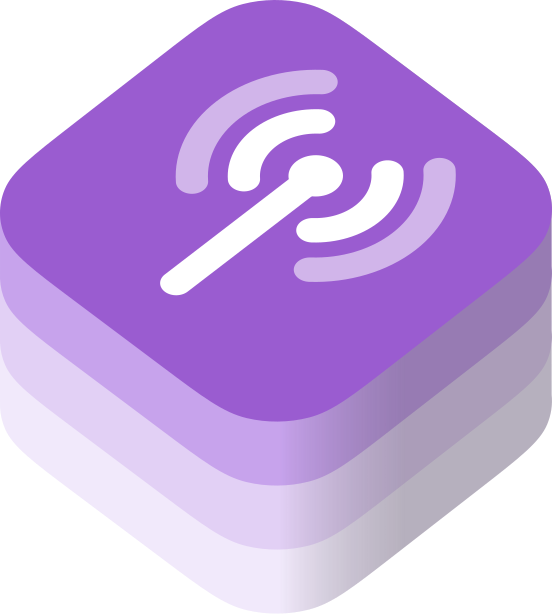

# RadioKit

[](https://github.com/binarydreams-io/RadioKit/actions/workflows/ci.yml)
[](https://github.com/binarydreams-io/RadioKit/releases)

<a href="https://binarydreams.io" target="_blank" rel="noopener noreferrer">
  
</a>

RadioKit is a Swift package for internet radio playback on Apple platforms.
It uses `AVPlayer` for live streams and integrates with system media controls.

Version `1.0.0` uses Swift tools 6.3 and requires Swift 6.3.3.
It supports iOS 17 or later and macOS 14 or later.
The package has no third-party package dependencies.

<br clear="left">
<br>

## Installation

Add RadioKit to your package:

```swift
.package(
  url: "https://github.com/binarydreams-io/RadioKit",
  from: "1.0.0"
)
```

Add the product to your target:

```swift
.product(name: "RadioKit", package: "RadioKit")
```

## Usage

Create a station, assign it to the shared player, and start playback on the main actor:

```swift
import Foundation
import RadioKit

@MainActor
func playExampleStation() {
  let primaryURL = URL(string: "https://example.com/live-aac")!
  let backupURL = URL(string: "https://example.com/live-mp3")!

  let station = RadioStation(
    id: UUID(),
    name: "Example Radio",
    info: "Live radio",
    streamURL: primaryURL,
    artworkURL: URL(string: "https://example.com/artwork.jpg"),
    streams: [
      RadioStreamCandidate(url: primaryURL, codec: "AAC", rank: 0),
      RadioStreamCandidate(url: backupURL, codec: "MP3", rank: 1),
    ]
  )

  let player = RadioPlayer.shared
  player.station = station
  player.play()
}
```

`RadioPlayer` uses Observation. Read its observable properties directly from a SwiftUI view or another Observation consumer.
Call `pause()` to stop playback, or set `station` to `nil` to clear the player and system integration.

## App Setup

### Background Audio On iOS

Enable **Background Modes** and select **Audio, AirPlay, and Picture in Picture** for the app target.
RadioKit configures the shared audio session for long-form playback when `play()` first succeeds.

Background playback and remote controls depend on app signing, capabilities, device state, and system policy.
Validate these behaviors on a physical device before release.

### Apple Music Enrichment

RadioKit parses timed stream metadata without Apple Music access.
When the user authorizes Apple Music, RadioKit searches the catalog for the parsed artist and title.

For this optional enrichment:

1. Register an explicit App ID that matches the app target's bundle identifier.
2. Enable the MusicKit App Service for that App ID in the Apple Developer portal.
3. Add `NSAppleMusicUsageDescription` to the app's information property list.
4. Request access with `MusicAuthorization.request()` from the host app.

MusicKit uses the registered bundle identifier to generate the developer token.
It does not require a separate key in the app's entitlements file.
An unregistered bundle identifier causes catalog requests to fail with `Client not found`.

If access is unavailable, the parsed artist and title remain available without catalog artwork or full song metadata.

## RadioPlayer Example

The complete SwiftUI example is in `Examples/RadioPlayer`.
See the [RadioPlayer example page](Examples/RadioPlayer/README.md) for its features, screenshots, MusicKit setup, and build instructions.

<table>
  <tr>
    <td align="center">
      <a href="Examples/RadioPlayer/README.md">
        
      </a>
    </td>
    <td align="center">
      <a href="Examples/RadioPlayer/README.md">
        
      </a>
    </td>
  </tr>
  <tr>
    <td align="center"><strong>Full player</strong></td>
    <td align="center"><strong>Lock Screen</strong></td>
  </tr>
</table>

<p align="center">
  <a href="Examples/RadioPlayer/README.md">
    
  </a>
  <br>
  <strong>Dynamic Island</strong>
</p>

1. Open the Xcode project in that directory.
2. Select the included app scheme and a supported destination.
3. Choose a development team if Xcode requests signing.
4. Run on a physical iOS device to evaluate background audio and remote commands.

The demo fetches the Record Rock Radio stream and artwork at runtime.
It bundles no station logo or audio and is not affiliated with or endorsed by Radio Record.

## Capabilities

- Live internet radio through `AVPlayer`.
- Ordered stream failover by availability and rank.
- Observable player, song, artwork, and App Group state.
- System Now Playing information and play, pause, and toggle commands.
- Network-loss recovery without consuming the next stream candidate.
- iOS audio-session interruption recovery and background playback support.
- ICY and other timed metadata exposed by `AVPlayerItemMetadataOutput`.
- Optional Apple Music catalog enrichment.
- Bounded remote artwork loading and dominant-color extraction.
- App Group synchronization for widgets and extensions.

## Architecture

RadioKit publishes one library product and one Swift module.
`RadioPlayer.shared` owns playback, stream selection, network monitoring, and system media integration on the main actor.

Setting a station builds an internal stream chain.
The chain sorts online candidates before offline candidates, then sorts each group by ascending rank.
When `AVPlayer` marks an item as failed, the player reports the failure and advances once.

System media integration activates lazily on the first playback request.
It remains active while a station is selected and clears when the station becomes `nil`.

See [Architecture](Documentation/architecture.md) and [Limitations](LIMITATIONS.md) for the detailed boundaries.

## Privacy And Security

RadioKit can contact station stream servers, artwork servers, and Apple Music.
It stores playback volume in standard `UserDefaults` and can write station state to an App Group suite.
The bundled privacy manifest declares the required-reason API entries for `UserDefaults`.

Artwork requests accept HTTP and HTTPS URLs without embedded credentials.
Responses are limited to 8 MiB, 4096 pixels per dimension, and 16,777,216 total pixels.
The host app's App Transport Security and local-network policies still apply.

See [Privacy and Security](Sources/RadioKit/RadioKit.docc/PrivacyAndSecurity.md) and [Security Policy](SECURITY.md).

## Verification

Run the package build and tests:

```bash
swift build -Xswiftc -warnings-as-errors
swift test
```

Build the documentation with Xcode:

```bash
xcodebuild docbuild -scheme RadioKit -destination 'generic/platform=macOS'
```

Live endpoint behavior, background audio, and system remote commands require integration testing in a host app.

## License And Project Links

RadioKit is available under the [MIT License](LICENSE).
That license covers repository code and documentation, not third-party streams or artwork fetched at runtime.

See [Changelog](CHANGELOG.md), [Credits](CREDITS.md), [Notices](NOTICE.md), [Provenance](PROVENANCE.md), [Contributing](CONTRIBUTING.md), [Support](SUPPORT.md), and [Code of Conduct](CODE_OF_CONDUCT.md).
